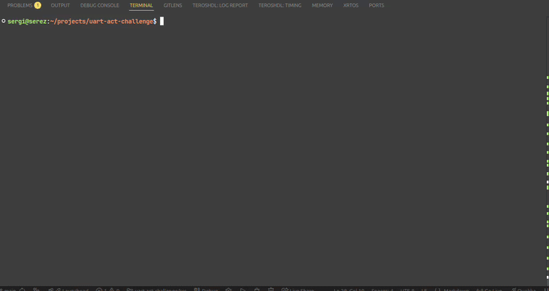
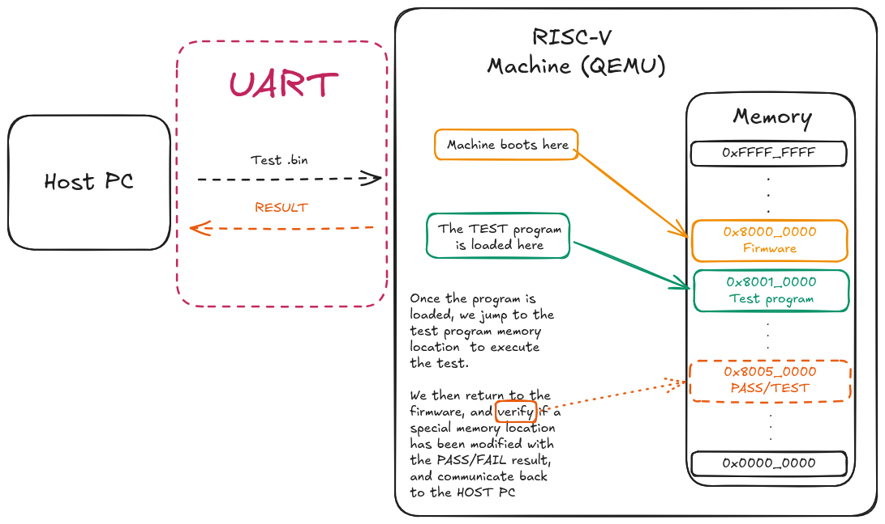
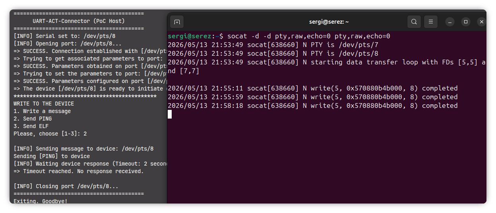
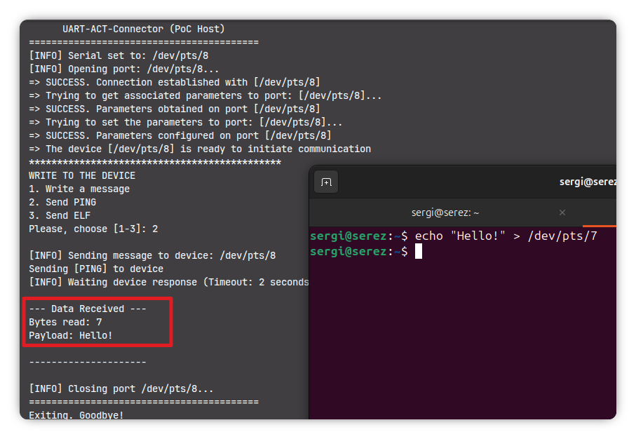

# UART-ACT-Connector

This is my submission to the coding challenge "RISC-V ACT Framework Enablement and M-Mode Firmware Validation on Hardware Board (RISC-V Mentorship)" with 10xEngineers.

> **Development Log:** You can read my daily progress, thoughts, and debugging process during this challenge in the [devlog.md](./devlog.md) file

> 

## What is this

This is a Proof-of-Concept framework designed to emulate a simple RISC-V ACT (Architecture Compliance Test) workflow sent over UART to a RISC-V machine.

This project initializes and configures a UART interface using the termios API to transmit and receives messages.

The correct behavior can be verified using a terminal with socat, and also, using QEMU simulating a RISC-V machine.

- Responds to PING command
- Accepts tests, simulating a simple ACT framework

The project virtualizes a RISC-V machine using QEMU, establishes UART communication between host and a pre-loaded firmware on that machine, uploads binaries sent by UART to specific memory location, jumps to that location to execute the program and then validates the execution results.

## How it works?

The following diagram exposes my purpose of implementation in this repository:



We load the firmware in the device, that will handle the communication and tests execution from the machine that we want to test.

This firmware lives at memory `0x80000000`. This firmware loads the program that we want to test at memory `0x80010000`.
The test executes, and could write in a particular region in memory, to then check for the PASS/FAIL status of the test.
The firmware could interrupt periodically the execution of the test, to verify that it's not hanging and to protect itself.

## File structure

## File structure

```
.
├── devlog.md                 # Daily progress and development notes
├── img/                      # Screenshots and diagrams
├── inc/                      # C header files
│   └── uart-act-challenge.h
├── Makefile                  # Build script for the host application
├── qemu_firmware/            # Bare-metal M-Mode firmware for QEMU
│   ├── boot.S                # Assembly startup code
│   ├── main.c                # Firmware logic (UART MMIO, LOAD, PING)
│   ├── linker.ld             # Firmware memory layout (starts at 0x80000000)
│   └── run_qemu.sh           # Script to compile firmware and launch QEMU
├── README.md                 # Project documentation
├── sample_elf_programs/      # Target test payloads
│   ├── sum.c                 # Sample ACT-like test
│   ├── linker.ld             # Test memory layout (starts at 0x80010000)
│   └── run_test.sh           # Script to compile and convert .elf to .bin
└── src/                      # Host application source code
    ├── interface.c           # CLI menu and user interactions
    ├── serial_comm.c         # UART termios initialization and transmission
    └── uart-act-challenge.c  # Main host program logic

```

## Features

- UART communication using Linux `termios`
- QEMU RISC-V hardware environment
- PING/PONG MMIO communication
- Binary transfers over UART
- Dynamic execution fro firmware
- PooC Pass/Fail execution
- Logging
- Scripts to automate compilation of the tests and setting up the QEMU environment

## How to use

The first step to run this program is to compile using the provided `Makefile` simply run `make` in the terminal

```bash
make
```

To execute the program, use the executable name: `uart-challenge`

```bash
./uart-challenge
```

### Simple communication



For this setup, we're going to use `socat`.

1. Set socat

```bash
socat -d -d pty,raw,echo=0 pty,raw,echo=0
```

In the `socat` output, we'll see the PTY that it opened to us.
For this particular example, socat opened `/dev/pts/8`

2. Update the PTY address in the program

This can be done either in code or passing the PTY as a program parameter

```c
# uart-act-challenge.h

# define DEFAULT_PORT "/dev/pts/8" // Specify the correct one

```

Or we can launch the program with the parameters:

```bash
make
./uart-challenge /dev/pts/8

```

3. Communicate with `socat`

Now, we can communicate sending messages and see that socat effectively received the data in the terminal. We can also communicate and send responses using socat to the program. To do that, we should use the other socat terminal open. We can use echo to send messages to it:

```bash
echo "Hello!" > /dev/pts/7
```



### RISC-V Machine using QEMU

#### What is QEMU?

QEMU is an open-source machine emulator and virtualizer. In this project, we use it to emulate a 64-bit RISC-V hardware board (virt machine). This allows us to run our custom M-mode bare-metal firmware, load binaries into RAM, and execute them without needing a physical RISC-V board.

#### Prerequisites

To run the emulation and compile the target tests, you need to install the following packages:

- qemu-system-riscv64: The QEMU emulator for RISC-V architectures.

- riscv64-unknown-elf-gcc: The RISC-V GNU Compiler Toolchain for bare-metal cross-compilation.

- socat: To establish the virtual serial ports (PTYs).

1. Set the environment

You can prepare your environment using the provided script in `/qemu_firmware/run_qemu.sh`

```bash
chmod +x qemu_firmware/run_qemu.sh
./qemu_firmware/run_qemu.sh
```

What this script does is compile the boot assembly, main firmware file, and linker script into an ELF file that will be loaded as our RISC-V Machine kernel.

```bash
# COMPILE
riscv64-unknown-elf-gcc -nostdlib -fno-builtin -mcmodel=medany -march=rv64g -mabi=lp64 -T qemu_firmware/linker.ld qemu_firmware/boot.S qemu_firmware/main.c -o qemu_firmware/firmware.elf

# RUN QEMU
qemu-system-riscv64 -machine virt -nographic -bios none -kernel qemu_firmware/firmware.elf -serial pty
```

2. Set the test

In order to load a program to the firmware we've just compiled for QEMU, we'll use the script provided in sample_elf_programs/run_test.sh.

```bash
chmod +x sample_elf_programs/run_test.sh
./sample_elf_programs/run_test.sh
```

What this script does is compile the test using a specific linker script (this is important because the test needs to be mapped to the 0x80010000 memory region) to an ELF file. Then, using objcopy, we extract the raw machine code to a .bin file so it can be transmitted byte-by-byte over UART.

There's also a debug print with objdump.

```bash
# Compile
riscv64-unknown-elf-gcc -nostdlib -fno-builtin -mcmodel=medany -march=rv64g -mabi=lp64 -T sample_elf_programs/linker.ld sample_elf_programs/sum.c -o sample_elf_programs/sum.elf

# Console debug
riscv64-unknown-elf-objdump -d sample_elf_programs/sum.elf

# Convert .elf to .bin
riscv64-unknown-elf-objcopy -O binary sample_elf_programs/sum.elf sample_elf_programs/sum.bin
```

## Coding Challenge Requirements Fulfilled

This repository satisfies the requirements outlined in the 10xEngineers mentorship challenge:

- Develop a C program that initializes and configures a UART interface (e.g., `/dev/ttyS0` or `/dev/ttyUSB0`) on Linux using the `termios` API. The program should:
- Configure UART parameters such as baud rate, data bits, parity, and stop bits
- Transmit a test message over the UART interface
- Receive incoming data using non-blocking I/O or a timeout mechanism (e.g., `select()` or `poll()`)
- Print any received data to the console
- Gracefully handle errors such as invalid device paths, permission issues, or read/write failures
- Include clear and well-structured comments explaining the implementation

## Technologies utilized

- C / Bare-Metal C: Core implementation language for both the host connector and the RISC-V firmware
- RISC-V Assembly: Minimal boot logic
- Linux System Programming: POSIX termios API for low-level serial communication
- QEMU: qemu-system-riscv64 for full system emulation
- RISC-V GNU Toolchain: Cross-compilation (x86->RV) (gcc, objcopy, objdump)
- Shell Scripting: Build automation and environment setup

## Resources

- [RISC-V](https://github.com/riscv)
- [RISC-V ACT Framework tests](https://github.com/riscv/riscv-arch-test)
- [LFX Mentorship - 10xEngineers](https://riscv.org/job/risc-v-act-framework-enablement-and-m-mode-firmware-validation-on-hardware-board-risc-v-mentorship/)
- [QEMU](https://www.qemu.org/)
- [UART Configuration in QEMU virt machine](https://caro.su/msx/ocm_de1/16550.pdf)
- [Linux Termios API Documentation (man pages)](https://man7.org/linux/man-pages/man3/termios.3.html)
